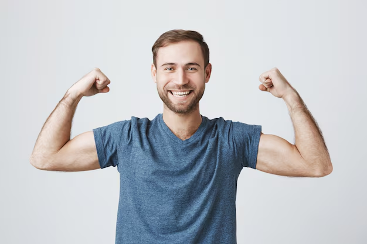
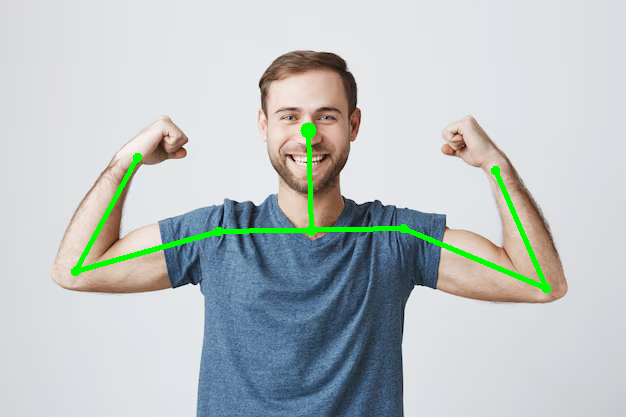
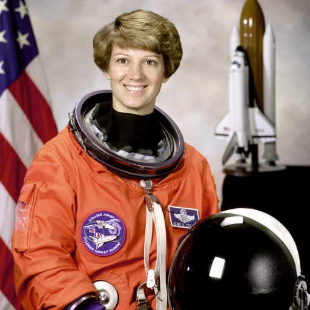
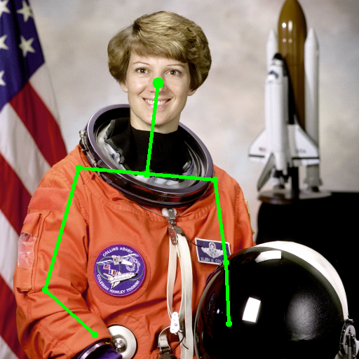
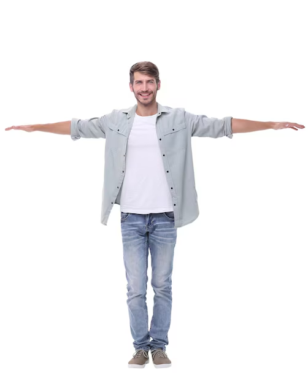
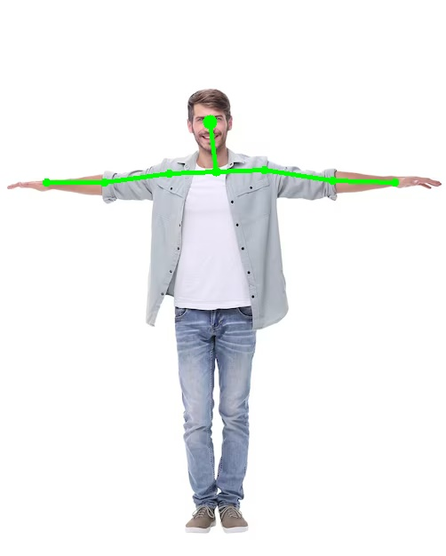

# Tool for shoulders, arms and head detection

# Get started
```bash
python3 -m venv venv
source venv/bin/activate
pip install -r requirements.txt
```
--------------------
# Some problems
According to task, I must use cv2.CascadeClassifier. It detects faces perfectly, but it detects shoulders and arms terribly.
I tried `haarcascade_upperbody.xml`, `haarcascade_fullbody.xml` and they are both awful. I tried to find different coefficients
(scaleFactor, minNeighbors) using brute force, but it did not help. You can see this attempts in coef_finding/ directory.

I tried cv2.contours and it was really bad... 

I decided to use mediapipe library. And it helped

------------------------
# How to use
You should use `initialize_pose_detector()` and get `pose_detector`, `mp_drawing` and `mp_pose` from it.

Using `with pose_detector:` you can call `process_image_with_pose_detection()`. 

You can find samples in `test()` function

### Variants of output paths
When input path is `None`:
* {script_directory}/sample_result/astronaut_detected.png - for the sample astronaut image

When output path is `None`:
* {input_directory}/{input_filename}_detected{input_extension}

When output path is a directory:
* {output_directory}/{input_filename}_detected.png

For valid output math with extensions: .jpg, .jpeg, .png, .bmp, .tiff, .tif, .webp:
* {output_path}

---------------------


# Results
| Before                                 | After                                     |
|----------------------------------------|-------------------------------------------|
|        |        |
|  |  |
|      |                   |
